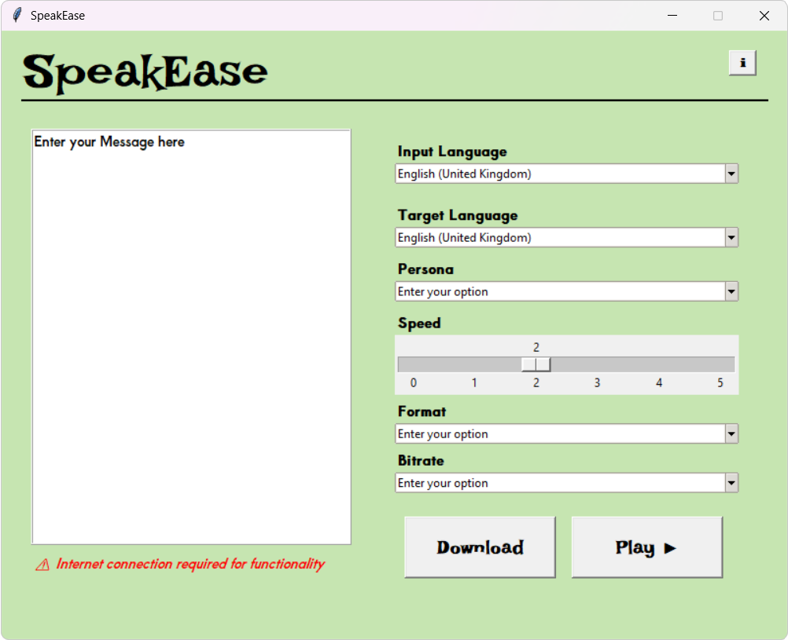

# SpeakEase - Multilingual Text-to-Speech Converter

 

## ✨ Features

### **Core Functionality**
- 🌍 **Auto-Translation**: Detects input language and translates to target language using Google Translate API
- 🗣 **25+ AI Voices**: Professional voice personas (Adam, Rachel, Santa Claus, etc.) via ElevenLabs API
- ⚡ **Audio Customization**:
  - Speed control (0.5x-2x via FFmpeg)
  - Bitrate selection (64-320 kbps)
  - Output formats (MP3, WAV, OGG, FLAC)

### **Technical Highlights**
- 🎚 **FFmpeg Integration**: Real-time audio processing (speed/bitrate adjustment)
- 📁 **Temp File Management**: Secure handling of temporary audio files
- 🖥 **Tkinter GUI**: Clean interface with custom styling

## 🛠️ Tech Stack

| Component          | Technology Used              |
|--------------------|------------------------------|
| **Text Processing**| `deep_translator`, `langdetect` |
| **TTS Engine**     | ElevenLabs API               |
| **Audio Processing**| FFmpeg (via `subprocess`)    |
| **GUI Framework**  | Tkinter (with ttk widgets)   |
| **File Handling**  | Python `tempfile` module     |
